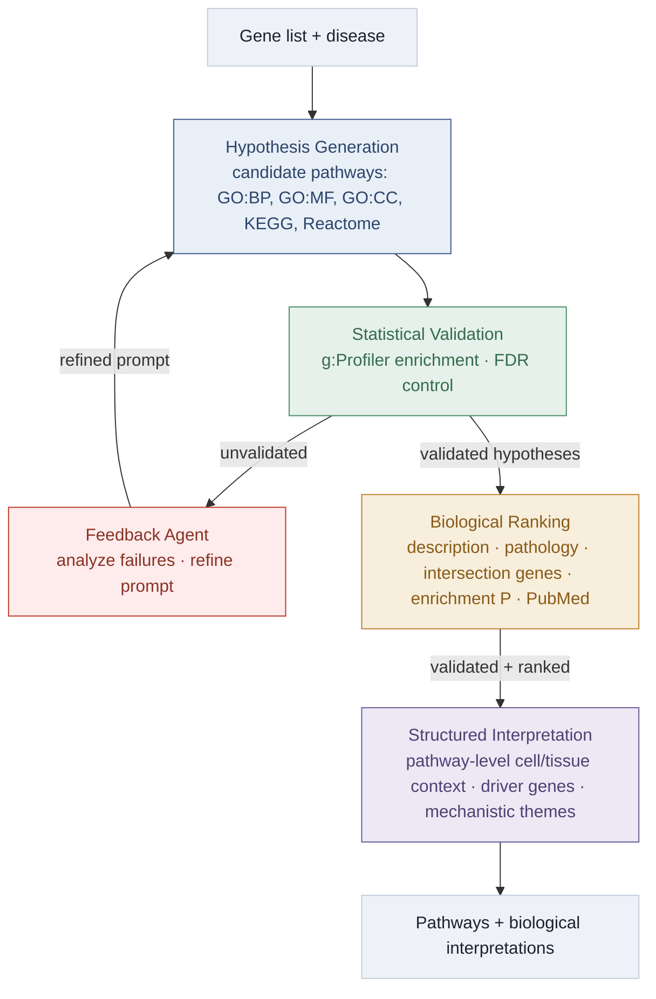

<h1 align="center">Reliable agentic AI platform for biological pathway inference of disease-associated genes</h1>

<p align="center">
  <em>A disease-context-aware agentic system that combines LLM reasoning with formal enrichment testing,
  biological ranking, feedback-guided refinement, and structured interpretation.</em>
</p>

<p align="center">
  
  
  
  
</p>

<p align="center">
  <b>🌐 Demo homepage:</b> <a href="https://tigerai.bio/pathway/">tigerai.bio/pathway/</a>
</p>

<p align="center">
  
</p>

<p align="center"><sub><b>Overview.</b> A human-expert-designed orchestrator connects four functional stages—pathway hypothesis generation, statistical validation, biological ranking, and structured interpretation—with a feedback-guided second generation pass.</sub></p>

---

## Overview

Pathway analysis turns disease-associated gene lists into mechanistic hypotheses, but conventional enrichment output often requires substantial manual interpretation. LLMs can generate fluent pathway narratives directly, yet plausible wording does not guarantee enrichment support. This platform treats every LLM-proposed pathway as a hypothesis that must pass explicit statistical and biological verification before it is reported.

Given a **disease** and a **gene list**, a human-expert-designed orchestrator runs a fixed, auditable workflow:

1. **Hypothesis generation** proposes ten candidates per database across GO:BP, GO:MF, GO:CC, KEGG, and Reactome, reasoning forward from the input genes and their documented pathway memberships.
2. **Statistical validation** matches each candidate to a database term and applies formal g:Profiler enrichment with multiple-testing correction; only terms with FDR-adjusted *P* < 0.05 are retained.
3. **Biological ranking** evaluates validated pathways independently within each database using five evidence components: pathway description, disease pathology, intersection genes, enrichment strength, and live PubMed literature.
4. **Feedback-guided refinement** summarizes validated and invalidated hypotheses with a keep–expand–avoid strategy, then launches one refined generation pass in the same disease–gene-list context.
5. **Structured interpretation** reports the selection rationale, driver genes and dominant functions, pathway-level tissue/cell context, mechanistic themes, and disease-relevance strength. Context assignments are interpretive outputs—not additional evidence of enrichment or cell abundance—and indirect support is flagged.

The interpretation stage itself calls no external tool. The user-facing implementation can separately attach provenance-preserving PubMed evidence to pathway-level context when matching disease, cell/tissue labels, and intersection genes are available.

The final-check benchmark contains **567 disease–gene-list pairs across 24 complex diseases**. Among database-matched terms, the disease-macro mean statistical-validation pass rate increased from **28.9% under the initial prompt to 39.8% under the refined prompt**. Statistical testing remains necessary after refinement because many new hypotheses still fail enrichment.

---

## The agent workflow

| Agent | Role | Module |
|---|---|---|
| 🤖 **Hypothesis Generation** | Reasons over module genes + disease to propose candidate pathways across five functional sources | [`agents/hypothesis_generation_agent.py`](agents/hypothesis_generation_agent.py) · [`predictor.py`](predictor.py) |
| ✅ **Statistical Validation** | Runs the formal enrichment test and writes the matched / FDR&nbsp;p&lt;0.05 / nominal validation contract | [`agents/statistical_validation_agent.py`](agents/statistical_validation_agent.py) |
| 🔁 **Feedback** | Converts validated and invalidated hypotheses into a keep–expand–avoid prompt for the second generation pass | [`agents/feedback_agent.py`](agents/feedback_agent.py) · [`prompts/feedback.py`](prompts/feedback.py) |
| 📊 **Biological Ranking** | Ranks validated pathways within each category by synthesizing five evidence sources | [`agents/biological_ranking_agent.py`](agents/biological_ranking_agent.py) |
| 🧩 **Interpretation** | Adds post-validation, pathway-level cell/tissue context to every supported pathway and detailed driver-gene / mechanistic interpretation to highlighted pathways | [`website/web_app/cell_context.py`](website/web_app/cell_context.py) · [`predictor.py`](predictor.py) · [`backend/reasoning_parser.py`](backend/reasoning_parser.py) |

The [`PipelineOrchestrator`](orchestrator.py) fixes the stage order, tool calls, feedback loop, and stopping rule: initial pass → validation and ranking → feedback-guided refined pass → aggregation and structured interpretation. These decisions are specified by human domain experts rather than planned autonomously by the LLM.

---

## Pipeline at a glance

<details>
<summary><b>Show the pipeline diagram</b></summary>



</details>

---

## Figure legends

<details>
<summary><b>Figure 1 · Agentic AI framework</b></summary>

**Figure 1. A reliable agentic AI framework for interpretable biological pathway discovery of disease-associated genes.** **(A)** Overview of the multi-agent pipeline. A gene list and a disease define a disease-specific context that passes through four agent-driven stages: hypothesis generation, statistical validation, biological ranking, and structured interpretation. An orchestrator (top) fixes the agent order, the tools called at each stage, the feedback loop and the stopping rule; this control flow was specified by human domain experts and was not planned autonomously by the language model. Every candidate pathway is treated as a hypothesis to be tested and validated before being reported, producing statistically validated, biologically meaningful pathways. A feedback agent summarizes validated and invalidated hypotheses into a refined prompt, and the orchestrator launches a second round of generation in the same context, retaining validated pathways and replacing those that failed. External tools are listed at the bottom right: pathway databases (GO:BP, GO:MF, GO:CC, KEGG and Reactome) for hypothesis generation, the g:Profiler API (term matching, enrichment testing and FDR correction) for statistical validation, and PubMed for literature retrieval during biological ranking; the interpretation agent calls no external tool. **(B)** Input and initial hypothesis generation. Conditioned on the paired gene list and disease, the hypothesis-generation agent proposes candidate pathways across five databases (GO:BP, GO:MF, GO:CC, KEGG, and Reactome), each queried through a database-specific instruction that respects the scope and nomenclature of that resource. The agent reasons forward from the input genes and their documented pathway memberships, and justifies each candidate against four criteria: functional convergence among the input genes, a mechanistic relationship linking the pathway to the disease, pathway database overlap, and disease relevance. **(C)** Statistical validation and biological ranking. The validation agent matches each generated hypothesis to the corresponding g:Profiler term and retains the hypothesis only if the matched term passes FDR-adjusted enrichment testing, returning matched identifiers, intersecting genes, and FDR-adjusted *P*-values. The biological ranking agent then ranks the validated pathways using five evidence components: pathway description, disease pathology, intersection genes, enrichment strength, and live PubMed literature. **(D)** Structured interpretation and output. For each database channel, the interpretation agent decomposes the unstructured reasoning path into structured insights concerning disease, tissue, and cell-type context. Grounded strictly in the statistically validated pathways, the resulting output comprises ranked pathways, the key driver genes and their molecular functions, the disease-relevant cell or tissue context, and the mechanistic themes linking pathways to disease biology, together producing pathways and biological interpretations. GO, Gene Ontology; GO:BP, GO biological process; GO:MF, GO molecular function; GO:CC, GO cellular component; KEGG, Kyoto Encyclopedia of Genes and Genomes; REAC, Reactome; FDR, false discovery rate; LLM, large language model.

</details>

<details>
<summary><b>Figure 2 · Statistical validation</b></summary>

**Figure 2. Statistical validation of LLM-generated pathway hypotheses.** Throughout, pass rate denotes the percentage of matched database terms that passed FDR-adjusted *P*-value < 0.05; unmatched hypotheses were excluded from the denominator. Of the 567 disease–gene-list pairs, those contributing no matched terms to a given database are excluded from that database, leaving 561 (GO:BP), 525 (GO:MF), 564 (GO:CC), 469 (KEGG) and 471 (REAC) pairs in A and C. **(A)** Distribution of pass rates across all gene–disease contexts, shown as kernel density estimates conditioned on non-zero pass rates; the inset reports the percentage of contexts with a zero pass rate per database (GO:BP, 28%; GO:MF, 31%; GO:CC, 24%; KEGG, 43%; REAC, 47%). **(B)** Disease-level pass rates (one value per disease; *n* = 24 diseases per database). Boxes show the interquartile range, center lines the median, whiskers the most extreme disease values within the 5th and 95th percentiles, diamonds the mean, and points show individual diseases. **(C)** Context-level pass rates stratified by gene-list-size quartile (Q1–Q4, computed within each database); cell color encodes mean pass rate, and per-cell *n* is shown. **(D)** Two representative contexts contrasting high (inflammatory bowel disease and 207 genes) and low (Crohn's disease and 116 genes) validation. Radar plots show per-database pass rate (%); tables list pass rates and examples of generated hypotheses, with check marks indicating hypotheses that reached statistical significance and crosses indicating those that did not. Abbreviations as in Figure 1.

</details>

<details>
<summary><b>Figure 3 · Feedback-guided prompt refinement</b></summary>

**Figure 3. Prompt refinement via feedback improves statistical validation pass rates.** The feedback agent analyzed validated and unvalidated hypotheses from the initial prompt and produced the refined prompt; initial and refined conditions are compared throughout. Pass rate denotes the percentage of database terms matched to new hypotheses that passed FDR-adjusted *P*-value < 0.05; retained terms are excluded from the refined-prompt denominator. **(A)** Disease-macro mean pass rates under the initial and refined prompts, overall and per database. Gene-list-level pass rates were averaged within each disease and database and then across 24 diseases with equal weight. For the overall value, the five database-specific values were first averaged within each disease. Whiskers denote 95% percentile intervals from a two-level bootstrap that resamples the 24 diseases with replacement and then resamples gene lists with replacement within each selected disease, with 3,000 resamples. Refinement raised the overall pass rate from 29% to 40%. **(B)** Disease-level comparison of initial versus refined pass rates, one point per disease. The dashed line marks equality (*y* = *x*); points above it indicate improvement under the refined prompt. All diseases except tuberculosis (black) lie above the diagonal, with the largest gains in heart failure and progressive supranuclear palsy. **(C)** A representative context (Crohn's disease and 116 genes) under the initial (left) and refined (right) prompt, plotted as in Figure 2D. Radar plots show per-database pass rate (%); tables list pass rates and example generated hypotheses, with check marks indicating hypotheses that reached statistical significance and crosses those that did not. Abbreviations as in Figure 1.

</details>

<details>
<summary><b>Figure 4 · Cell-context interpretation and aggregation</b></summary>

**Figure 4. Record-level cell-context interpretation and pathway-level aggregation of validated pathways.** Cell-type tags were parsed from the record-level cell context statement carried by each validated pathway record; tagging is multi-label and each record contributes at most once to a given tag. Disease- and pathway-level labels aggregate these tags over all validated records of a disease or of a pathway. Cell-context groups—neural or glial, immune, epithelial, stromal or vascular, and metabolic—are colored consistently throughout the figure, and disease classes are colored in a separate family of lighter tints. **(A)** From reasoning path to cell-type tags, for four validated pathways in four diseases: endocytosis (GO:0006897) in Alzheimer's disease (AD), lysosome (GO:0005764) in Parkinson's disease (PD), Fc gamma R-mediated phagocytosis (KEGG:04666) in rheumatoid arthritis and insulin secretion (GO:0030073) in type 2 diabetes (T2D). Part 7 of the reasoning path (Supplementary Fig. S1) provides the cell context associated with each validated pathway record; quoted text is verbatim. Phrases from which tags were parsed are highlighted and colored by cell-context group, with the resulting tags listed at the right in matching colors. A modifier qualifying a head noun yields both tags, so dopaminergic neurons yields dopaminergic neurons and neurons. **(B)** Record-level cell contexts across 24 diseases. Each cell gives the proportion of a disease's validated pathway records whose cell context statement mentions the indicated lineage (0–1). Records can contribute to several columns, so rows need not sum to 1. Black outlines mark the largest proportion among the eleven displayed broad contexts within each disease. Markers at the left of each row give disease class and column labels are colored by cell-context group, with both keys printed at the foot of the figure. **(C)** Disease-level cell-type contexts. Bars give the number of a disease's validated pathway records carrying each cell-type tag, colored by cell-context group, with the percentage of that disease's records in parentheses. The ten most frequent tags are shown for AD (*n* = 310 records) and the five most frequent for PD (*n* = 412 records) and T2D (*n* = 763 records). Because tagging is multi-label, percentages within a disease sum to more than 100%. All 24 diseases are given in Supplementary Figure S3 and Supplementary Table S3. **(D)** Pathway-level cell-type context in AD. Rows are the 11 pathways represented by at least four validated pathway records in the AD cell-context dataset (310 records, 213 unique pathway identifiers); columns are the ten most frequent cell-type tags among these recurrent pathways, ordered as in Supplementary Figure S5. Each cell gives the tag frequency of that pathway, that is, the number of its validated records whose cell context statement received the tag, not a proportion. These pathways are represented by four to seven records each; blank cells denote zero and shading follows the tag-frequency key. All 23 recurrent pathways with at least three records are shown in Supplementary Figure S5 and their tissue counterparts in Supplementary Figure S6. Cell-type assignments are multi-label structured-interpretation outputs; they do not measure cell abundance, expression, enrichment strength or statistical significance and are not independent evidence of disease-specific cell-type involvement.

</details>

<details>
<summary><b>Figure 5 · Cross-disease memory transfer</b></summary>

**Figure 5. Cross-disease memory provides limited cold-start transfer and does not substitute for context-specific refinement.** Grouped bars show per-database pass rates under six prompting strategies: initial prompt, raw memory, semantic RAG, RAG+, RAG+ prompt, and refined prompt, in each of the five databases; pass rate is defined as in Figure 3. All six strategies were evaluated on the same 69 gene-list pairs from five diseases used for the cold-start test (Methods). Whiskers denote 95% percentile intervals from a two-level bootstrap that resamples the five diseases with replacement and then resamples gene lists with replacement within each selected disease, with 3,000 resamples. Only the refined prompt, which is built from feedback within the same gene–disease context, improves substantially on the initial prompt (GO:BP, 24.5% to 43.4%; GO:MF, 25.3% to 47.6%; GO:CC, 26.9% to 47.8%; KEGG, 31.5% to 42.5%; REAC, 28.2% to 50.2%); the four memory-transfer strategies stay within a few percentage points of the initial prompt in every database. RAG, retrieval-augmented generation; other abbreviations as in Figure 1.

</details>

<details>
<summary><b>Figure 6 · User-facing platform output</b></summary>

**Figure 6. End-to-end output of the user-facing platform.** Results are shown for the updated autism spectrum disorder (ASD) run (436 input genes; GPT-5.1). **(A)** Overview. Of 436 submitted identifiers, 431 were recognized and five were unresolved. The first pass generated 50 hypotheses, and feedback-guided refinement increased coverage to 60 validated pathways. Across both passes, 100 hypotheses were generated (10 per database per pass), of which 64 passed validation; after matching to database terms and removing duplicates across passes, 60 unique pathways remained. Database bars show the final validated set (GO:BP, 21; GO:MF, 12; GO:CC, 12; KEGG, 9; Reactome, 6). Cell-type context was assigned to 60 of 60 validated pathways. Cell-type bars show cortical neurons, 44 of 60 (73%); hippocampal neurons, 35 of 60 (58%); pyramidal neurons, 25 of 60 (42%); excitatory neurons, 18 of 60 (30%); and inhibitory neurons, 6 of 60 (10%). **(B)** Pathway enrichment overview. The plot shows the three highest biologically ranked pathways within each of GO:BP, GO:MF, GO:CC, KEGG and Reactome. Rows are ordered by biological rank within each database; horizontal position represents enrichment strength (−log10 adjusted *P*-value), point area represents the number of submitted genes in the pathway intersection, and color denotes the source database. Exact adjusted *P*-values are listed at right and provide statistical support independent of the biological ranking. **(C)** Interpretation of a representative high-ranking GO:BP pathway. Neuron projection development (GO:0031175) ranked second among GO:BP pathways by biological rank. The record is decomposed into statistical evidence (FDR-adjusted *P*-value = 5.40 × 10<sup>−25</sup>; 81 of 1,010 annotated genes overlapping the input list), key intersection genes (81 genes, including four functional clusters, with CNTNAP2, FMR1 and PTEN as principal drivers), and the cell- and tissue-context statement (developing cortical and hippocampal projection neurons and their axons and dendrites). Boxed numbers 1–3 denote the three evidence elements; bracketed numbers [1]–[4] identify platform-retrieved PubMed records listed beneath the interpretation. Abbreviations as in Figure 1.

</details>

---

## Installation

```bash
git clone https://github.com/Grit1021/Agentic_AI_platform.git
cd Agentic_AI_platform
python -m venv .venv && source .venv/bin/activate
pip install -r requirements.txt      # pandas, numpy, biopython, gprofiler-official, openai, matplotlib, ...
```

Set the required environment variables:

```bash
export OPENAI_API_KEY="sk-..."          # required: generation, feedback, ranking, interpretation
export ENTREZ_EMAIL="name@example.com"  # recommended: PubMed / Entrez access
```

`OPENAI_API_KEY` powers all LLM stages. `ENTREZ_EMAIL` is recommended so PubMed evidence retrieval runs without throttling. The default model (`gpt-5.1`) is configurable in [`llm_client.py`](llm_client.py); LLM responses are disk-cached under `~/.cache/pathway_analysis/`.

---

## Quickstart

Run commands from the directory that contains this package.

```bash
# Full analysis for Alzheimer's disease
python -m refined.orchestrator --disease AD --tag full_run

# Fast smoke test (a couple of modules only)
python -m refined.orchestrator --disease AD --test --tag test_run

# Disable optional memory-bank storage
python -m refined.orchestrator --disease AD --test --no-memory --tag no_memory
```

`--disease` accepts an abbreviation (e.g. `AD`, `PD`, `MS`, `T2D`) **or** a full disease name. Disease metadata (MeSH ID, description, keywords) is resolved automatically from NCBI/MeSH — no hardcoding required.

<details>
<summary><b>24-disease benchmark (as reported in the paper)</b></summary>

Spanning neurodegenerative, cardiovascular, autoimmune, metabolic, infectious, oncological, respiratory, renal, and dermatological conditions:

`AD, PD, ALS, PSP, MDD, MS, RA, AIT, SLE, PS, IBD, CD, COPD, AST, CAD, AF, HF, HTN, T2D, CKD, OSA, TB, CRC, HCC`

Any other disease can be analyzed by passing its name or abbreviation — metadata is resolved from NCBI/MeSH.
</details>

---

## Input data

The workflow reads network-expansion module files:

```
Network_expansion/outputs/disease_pair_expansion/{MESH_ID}_modules.csv
```

| Column | Required | Meaning |
|---|---|---|
| `node` | ✅ | Gene symbol |
| `cluster_walktrap` | ✅ | Module ID (rows with `-1` are excluded) |
| `passes_all_filters` | optional | If present, only passing genes are used |

---

## Outputs

Each run writes to `iterative_feedback_{DISEASE}/{DISEASE}_aggregated_{TIMESTAMP}_{TAG}/`:

- `phase1_module_collection/Module_{id}_filtered_pathways.csv` — per-module validated pathways
- iter1 statistical-validation contract: `*_gpt_matched_all.csv`, `*_gpt_matched_fdr_p005.csv`, `*_gpt_matched_nominal_p005.csv`
- per-module Phase 2 iteration outputs and `*_reasoning.md` audit traces
- `final_aggregated_pathways.csv` — ranked, validated pathways across all modules
- `final_module_metadata.json`
- `summary_iterative/summary_pathway_ranking.txt`
- post-validation pathway-level `cell_context`, provenance, and label/gene-mapped PubMed evidence in website/API result records
- validation / category plots ([`visualization.py`](visualization.py))
- optional memory-bank storage artifacts (when enabled; retrieval was not used in the primary benchmark)

---

## Repository layout

```text
.
├── orchestrator.py        # command-line entry point & pipeline coordinator
├── config.py              # disease configuration (MeSH/NCBI lookup, abbreviations)
├── framework.py           # iterative framework wired to the Feedback agent
├── predictor.py           # hypothesis generation + reasoning-audit traces
├── llm_client.py          # LLM client + disk cache
├── report.py              # summary report generation
├── visualization.py       # validation & category plots
├── agents/                # four stage agents plus the feedback agent
├── prompts/               # prompt templates (generation, feedback, reasoning audit)
├── tools/                 # PubMed, ranking, g:Profiler cache utilities
├── backend/               # bundled runtime modules (multi-agent analysis, optional memory storage)
├── website/web_app/       # Interactive app, including pathway-level cell-context mapping
├── docs/                  # GitHub Pages demo homepage (index.html)
└── assets/                # Framework overview (PNG/PDF)
```

---

## Reproducibility

Full runs call external services—OpenAI, NCBI/MeSH, PubMed/Entrez, and g:Profiler. Reproducing the manuscript results requires the same input gene lists, disease labels, GPT-5.1 configuration, prompt templates, database versions, and archived outputs. The primary benchmark stored validated pathways in the memory bank but did not retrieve them during generation; retrieval was evaluated only in the dedicated 69-pair cold-start transfer experiment. Disk caching of LLM responses (`~/.cache/pathway_analysis/`) reduces repeated calls.

---

## Citation

```bibtex
@misc{li2026reliable_agentic_ai,
  title  = {Reliable agentic AI platform for biological pathway inference of disease-associated genes},
  author = {Li, Yuxin and Yang, Yilin and Shu, Juan and Zhang, Zichen and Li, Bingxuan and Fan, Zirui and Zhao, Bingxin},
  year   = {2026},
  url    = {https://github.com/Grit1021/Agentic_AI_platform}
}
```

Publication metadata will be added when the manuscript is publicly available. Questions and issues are welcome via the repository issue tracker.
