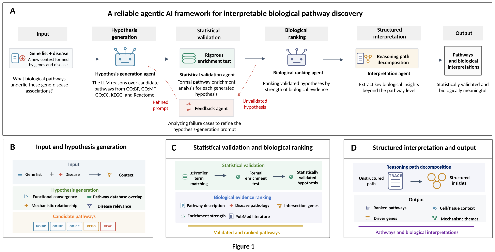
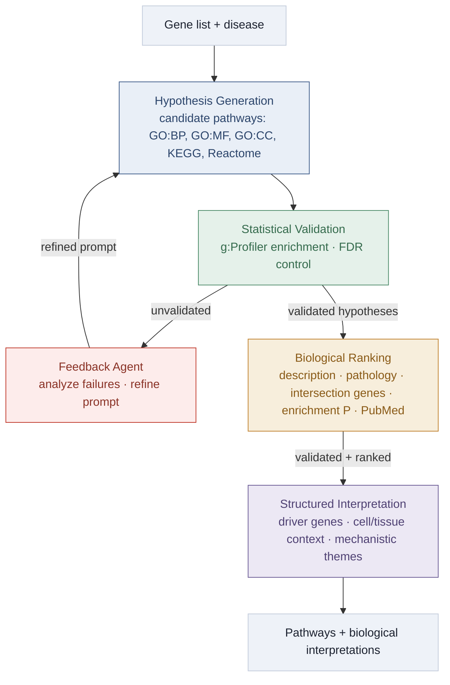

<h1 align="center">A reliable agentic AI framework for interpretable biological pathway discovery</h1>

<p align="center">
  <em>An LLM multi-agent system that turns a gene list + disease into statistically validated,
  biologically meaningful, and human-interpretable pathways.</em>
</p>

<p align="center">
  
  
  
  
  
</p>

<p align="center">
  <b>🌐 Demo homepage:</b> <a href="https://grit1021.github.io/Agentic_AI_platform/">grit1021.github.io/Agentic_AI_platform</a> &nbsp;·&nbsp;
  <b>📄 Paper:</b> <a href="#">[arXiv / DOI]</a> &nbsp;·&nbsp;
  <b>💻 Code:</b> <a href="https://github.com/Grit1021/Agentic_AI_platform">github.com/Grit1021/Agentic_AI_platform</a>
</p>

<p align="center">
  
</p>

<p align="center"><sub><b>Figure 1.</b> Overview of the agentic framework (A) and its three functional stages: input &amp; hypothesis generation (B), statistical validation &amp; biological ranking (C), and structured interpretation &amp; output (D).</sub></p>

> **Before publishing.** Fill in the [Authors] and paper-link ([arXiv / DOI]) placeholders. The GitHub and Pages URLs are already set.

---

## Overview

Standard enrichment tools answer *"which annotation terms are over-represented in my gene list?"* — but they do not explain why one term should be prioritized over a related one, whether a plausible pathway is actually supported by the genes, or how pathways combine into a disease-relevant narrative. Large language models propose fluent pathway names, yet in zero-shot settings many are broad, weakly matched, or unsupported by FDR-controlled enrichment. This **closed-loop, agentic framework** closes the gap between *linguistic fluency* and *statistical reliability*: hypotheses are proposed, validated against g:Profiler under FDR control, corrected with explicit feedback, and ranked by biological evidence.

Given a **disease** and a **module of genes**, the system:

1. **Generates** candidate pathway hypotheses by reasoning over GO:BP, GO:MF, GO:CC, KEGG, and Reactome.
2. **Validates** every hypothesis with a formal g:Profiler enrichment test (FDR control).
3. **Learns from failures** — a feedback agent analyzes unvalidated hypotheses and refines the generation prompt across iterations.
4. **Ranks** validated pathways by strength of biological evidence, synthesizing pathway description, disease pathology (NCBI MeSH), intersection genes, enrichment P values, and PubMed literature.
5. **Interprets** the results, decomposing the reasoning path into structured insights: driver genes, cell/tissue context, and mechanistic themes.

The output is a set of pathways that are **statistically validated *and* biologically meaningful**, each accompanied by a transparent reasoning trace.

Across a 24-disease benchmark, zero-shot generation validates only 29.0% of non-redundant matched pathways; validation-guided feedback raises this **non-redundant functional discovery rate (nFDR)** to 42.2%.

---

## The agent team

| Agent | Role | Module |
|---|---|---|
| 🤖 **Hypothesis Generation** | Reasons over module genes + disease to propose candidate pathways across five functional sources | [`agents/hypothesis_generation_agent.py`](agents/hypothesis_generation_agent.py) · [`predictor.py`](predictor.py) |
| ✅ **Statistical Validation** | Runs the formal enrichment test and writes the matched / FDR&nbsp;p&lt;0.05 / nominal validation contract | [`agents/statistical_validation_agent.py`](agents/statistical_validation_agent.py) |
| 🔁 **Feedback** | Analyzes failure cases to refine the hypothesis-generation prompt between iterations | [`agents/feedback_agent.py`](agents/feedback_agent.py) · [`prompts/feedback.py`](prompts/feedback.py) |
| 📊 **Biological Ranking** | Ranks validated pathways within each category by synthesizing five evidence sources | [`agents/biological_ranking_agent.py`](agents/biological_ranking_agent.py) |
| 🧩 **Interpretation** | Decomposes the reasoning path into structured, cross-pathway biological insights | [`predictor.py`](predictor.py) · [`backend/reasoning_parser.py`](backend/reasoning_parser.py) |

All agents are coordinated by the [`PipelineOrchestrator`](orchestrator.py) (Phase 1 → Phase 2 iterations → aggregation → finalization).

---

## Pipeline at a glance

<details>
<summary><b>Show the pipeline diagram</b></summary>



</details>

---

## Installation

```bash
git clone https://github.com/Grit1021/Agentic_AI_platform.git
cd Agentic_AI_platform
python -m venv .venv && source .venv/bin/activate
pip install -r requirements.txt      # pandas, numpy, biopython, gprofiler-official, openai, matplotlib, ...
```

Set the required environment variables:

```bash
export OPENAI_API_KEY="sk-..."          # required: generation, feedback, ranking, interpretation
export ENTREZ_EMAIL="name@example.com"  # recommended: PubMed / Entrez access
```

`OPENAI_API_KEY` powers all LLM stages. `ENTREZ_EMAIL` is recommended so PubMed evidence retrieval runs without throttling. The default model (`gpt-5.1`) is configurable in [`llm_client.py`](llm_client.py); LLM responses are disk-cached under `~/.cache/pathway_analysis/`.

---

## Quickstart

Run commands from the directory that contains this package.

```bash
# Full analysis for Alzheimer's disease
python -m refined.orchestrator --disease AD --tag full_run

# Fast smoke test (a couple of modules only)
python -m refined.orchestrator --disease AD --test --tag test_run

# Disable cross-disease memory-bank storage
python -m refined.orchestrator --disease AD --test --no-memory --tag no_memory
```

`--disease` accepts an abbreviation (e.g. `AD`, `PD`, `MS`, `T2D`) **or** a full disease name. Disease metadata (MeSH ID, description, keywords) is resolved automatically from NCBI/MeSH — no hardcoding required.

<details>
<summary><b>24-disease benchmark (as reported in the paper)</b></summary>

Spanning neurodegenerative, cardiovascular, autoimmune, metabolic, infectious, oncological, respiratory, renal, and dermatological conditions:

`AD, PD, ALS, PSP, MDD, MS, RA, AIT, SLE, PS, IBD, CD, COPD, AST, CAD, AF, HF, HTN, T2D, CKD, OSA, TB, CRC, HCC`

Any other disease can be analyzed by passing its name or abbreviation — metadata is resolved from NCBI/MeSH.
</details>

---

## Input data

The workflow reads network-expansion module files:

```
Network_expansion/outputs/disease_pair_expansion/{MESH_ID}_modules.csv
```

| Column | Required | Meaning |
|---|---|---|
| `node` | ✅ | Gene symbol |
| `cluster_walktrap` | ✅ | Module ID (rows with `-1` are excluded) |
| `passes_all_filters` | optional | If present, only passing genes are used |

---

## Outputs

Each run writes to `iterative_feedback_{DISEASE}/{DISEASE}_aggregated_{TIMESTAMP}_{TAG}/`:

- `phase1_module_collection/Module_{id}_filtered_pathways.csv` — per-module validated pathways
- iter1 statistical-validation contract: `*_gpt_matched_all.csv`, `*_gpt_matched_fdr_p005.csv`, `*_gpt_matched_nominal_p005.csv`
- per-module Phase 2 iteration outputs and `*_reasoning.md` audit traces
- `final_aggregated_pathways.csv` — ranked, validated pathways across all modules
- `final_module_metadata.json`
- `summary_iterative/summary_pathway_ranking.txt`
- validation / category plots ([`visualization.py`](visualization.py))
- memory-bank summary + network exports (when enabled)

---

## Repository layout

```text
.
├── orchestrator.py        # command-line entry point & pipeline coordinator
├── config.py              # disease configuration (MeSH/NCBI lookup, abbreviations)
├── framework.py           # iterative framework wired to the Feedback agent
├── predictor.py           # hypothesis generation + reasoning-audit traces
├── llm_client.py          # LLM client + disk cache
├── report.py              # summary report generation
├── visualization.py       # validation & category plots
├── agents/                # the five specialized agents
├── prompts/               # prompt templates (generation, feedback, reasoning audit)
├── tools/                 # PubMed, ranking, g:Profiler cache utilities
├── backend/               # bundled runtime modules (multi-agent analysis, memory bank)
├── docs/                  # GitHub Pages demo homepage (index.html)
└── assets/                # Figure 1 (PNG/PDF)
```

---

## Reproducibility

Full runs call external services — OpenAI, NCBI/MeSH, PubMed/Entrez, and g:Profiler. Reproducing manuscript results requires the same input module files, disease configuration, environment, model settings, and archived output directories. Deterministic disk caching of LLM responses (`~/.cache/pathway_analysis/`) makes re-runs stable and cheaper.

---

## Citation

```bibtex
@article{AUTHOR_YEAR_agentic_pathways,
  title   = {A reliable agentic AI framework for interpretable biological pathway discovery},
  author  = {[Authors]},
  journal = {[Journal / Preprint]},
  year    = {[Year]},
  url     = {https://github.com/Grit1021/Agentic_AI_platform}
}
```

## License

Released under the MIT License (placeholder — update as needed). Questions and issues welcome via the repository issue tracker.
